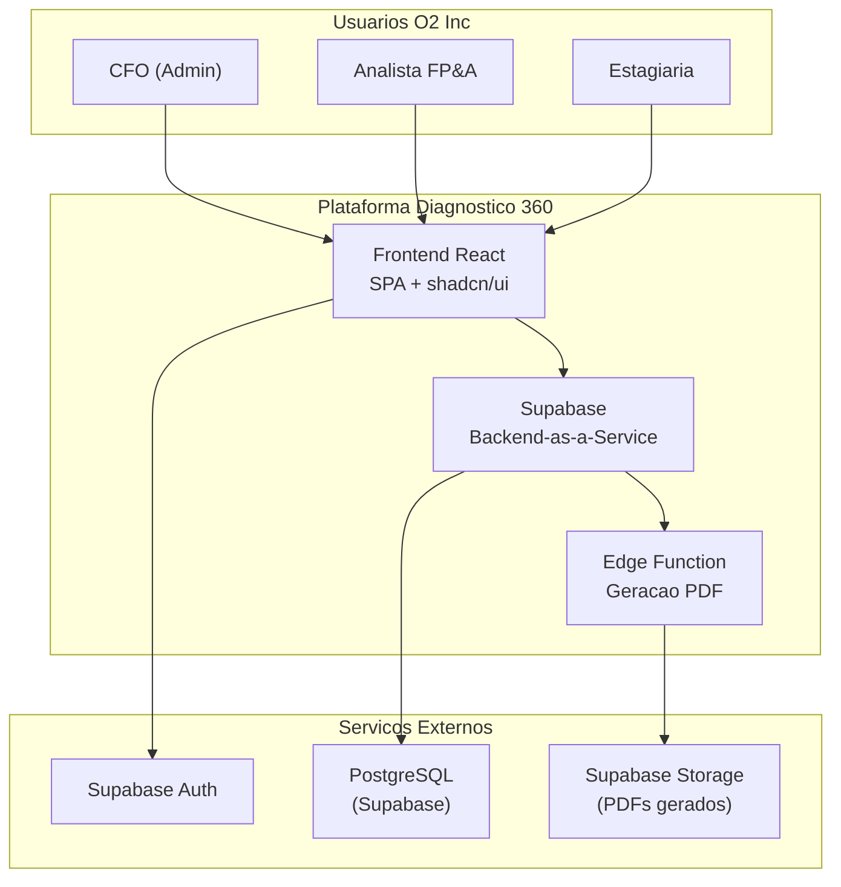
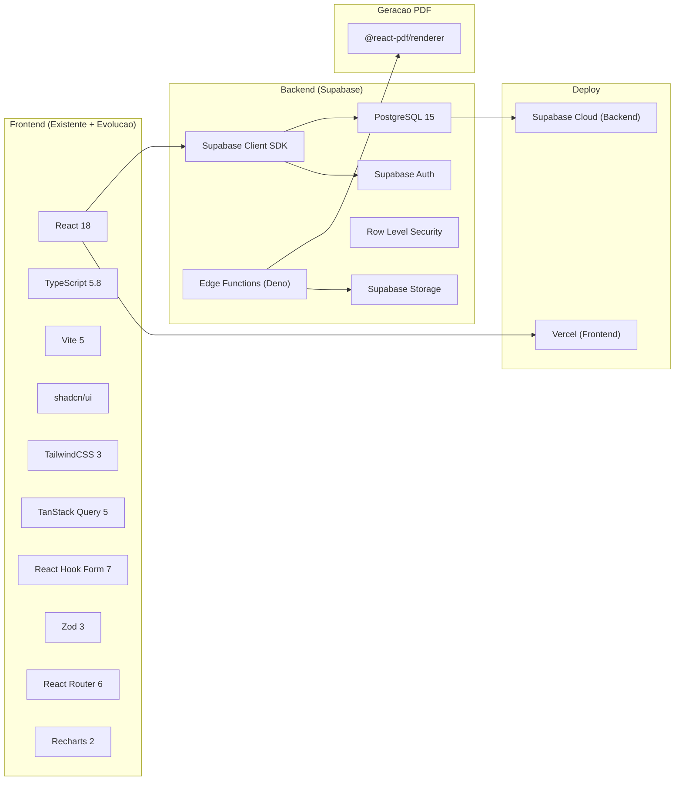
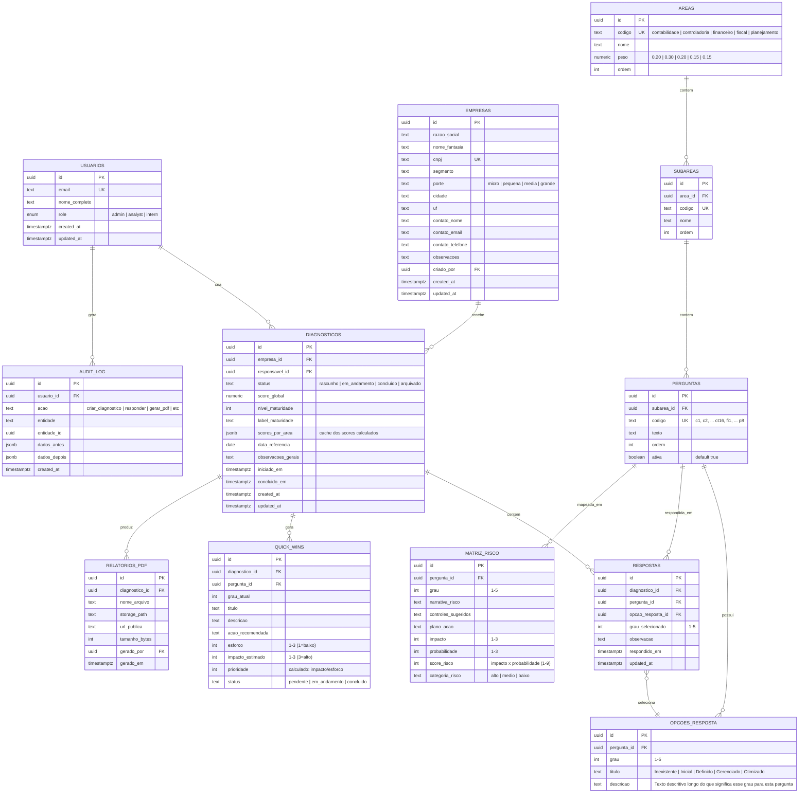
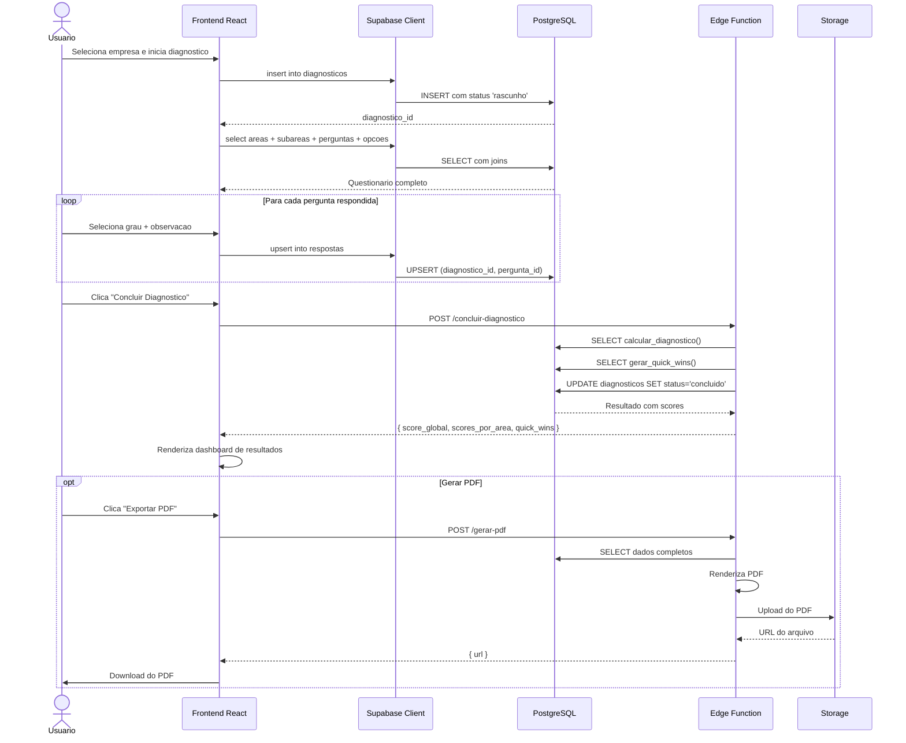
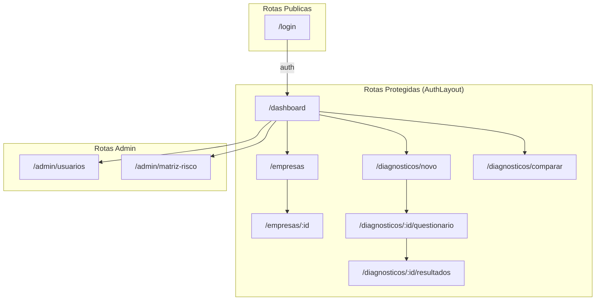
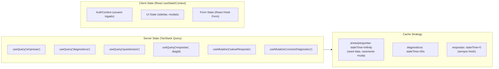
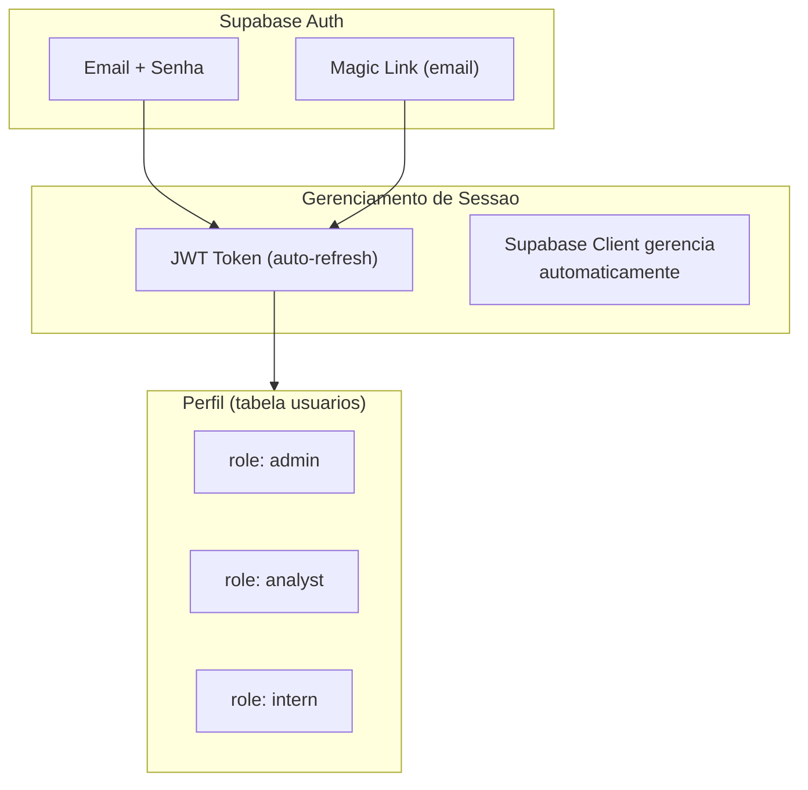
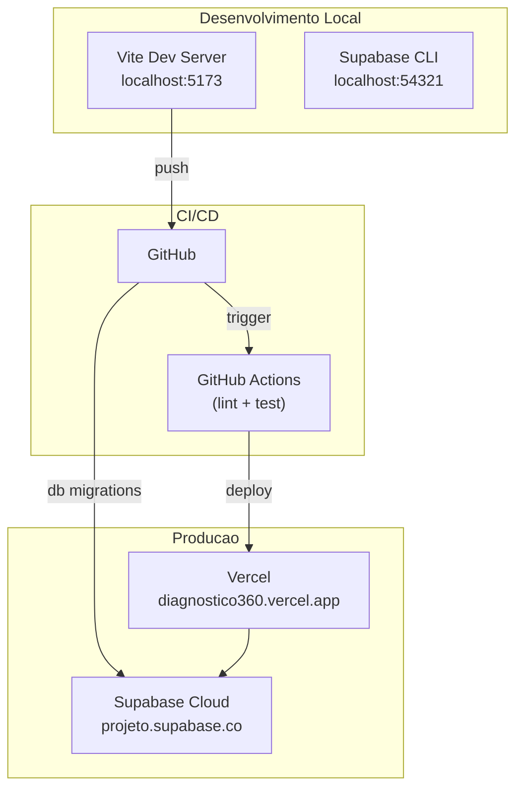

# Arquitetura da Plataforma Diagnostico 360 -- O2 Inc

> **Documento de Arquitetura** | Fase 0A -- Definicao de Arquitetura
> **Autor:** Aria (System Architect Agent)
> **Data:** 2026-03-23
> **Status:** Proposta para aprovacao
> **Projeto:** data-weaver (Diagnostico 360 para CFOs as a Service)

---

## Sumario

1. [Visao Geral](#1-visao-geral)
2. [Decisao de Backend -- Comparativo](#2-decisao-de-backend--comparativo)
3. [Stack Tecnologico Definido](#3-stack-tecnologico-definido)
4. [Modelo de Dados](#4-modelo-de-dados)
5. [Arquitetura de API](#5-arquitetura-de-api)
6. [Arquitetura Frontend](#6-arquitetura-frontend)
7. [Arquitetura de Seguranca](#7-arquitetura-de-seguranca)
8. [Estrategia de Deploy](#8-estrategia-de-deploy)
9. [ADRs (Architecture Decision Records)](#9-adrs)
10. [Roadmap de Implementacao](#10-roadmap-de-implementacao)

---

## 1. Visao Geral

### 1.1 Contexto

A O2 Inc oferece CFOs as a Service em Porto Alegre. O time de Servicos Especiais (1 CFO + 1 Analista FP&A + 1 Estagiaria) precisa de uma plataforma para substituir o processo atual baseado em Excel/VBA/PowerPoint por um sistema web para realizar diagnosticos financeiros 360 graus em empresas clientes.

### 1.2 Objetivos Arquiteturais

| Prioridade | Objetivo | Justificativa |
|---|---|---|
| P0 | Simplicidade operacional | Time de 3 pessoas, sem DevOps dedicado |
| P0 | Custo baixo/zero inicial | Startup interna, budget limitado |
| P1 | Geracao de PDF profissional | Substituir PowerPoint/VBA |
| P1 | Persistencia confiavel | Salvar diagnosticos, historico, comparacoes |
| P2 | Multi-usuario com permissoes | CFO, analista, estagiaria |
| P2 | Escalabilidade moderada | Pode crescer para mais equipes |

### 1.3 Diagrama de Contexto (C4 - Nivel 1)



---

## 2. Decisao de Backend -- Comparativo

### 2.1 Opcoes Avaliadas

#### Opcao A: Supabase

| Aspecto | Avaliacao |
|---|---|
| **Banco de Dados** | PostgreSQL completo, relacional, com SQL real |
| **Auth** | Integrado, suporte a email/senha, magic link, OAuth |
| **API** | Auto-gerada via PostgREST (REST) + cliente TypeScript tipado |
| **Row Level Security** | Nativo no PostgreSQL, policies por role |
| **Realtime** | Subscriptions nativas (util para colaboracao futura) |
| **Edge Functions** | Deno-based, ideal para geracao de PDF |
| **Storage** | Integrado para armazenar PDFs gerados |
| **Custo** | Free tier: 500MB DB, 1GB storage, 500K edge invocations/mes |
| **Curva de aprendizado** | Baixa para quem conhece SQL |
| **Client SDK** | `@supabase/supabase-js` com TypeScript nativo |
| **Migracao futura** | Facil -- e PostgreSQL padrao, pode migrar para qualquer host |

**Pros:**
- PostgreSQL real = modelo relacional ideal para este dominio (perguntas, respostas, riscos, pesos)
- RLS nativo resolve permissoes sem codigo custom
- SDK TypeScript com tipagem automatica das tabelas
- Free tier generoso para 3 usuarios
- Edge Functions para PDF server-side
- Zero infraestrutura para gerenciar

**Contras:**
- Vendor lock-in parcial (mitigado por ser PostgreSQL padrao)
- Edge Functions sao Deno (nao Node), leve ajuste
- Limite de 500MB no free tier (mais que suficiente para este caso)

#### Opcao B: Firebase (Firestore + Auth + Functions)

| Aspecto | Avaliacao |
|---|---|
| **Banco de Dados** | Firestore (NoSQL, orientado a documentos) |
| **Auth** | Robusto, muitos providers |
| **API** | SDK client-side, sem REST auto-gerado |
| **Seguranca** | Security Rules (linguagem propria, nao SQL) |
| **Functions** | Cloud Functions (Node.js) |
| **Storage** | Firebase Storage |
| **Custo** | Spark (free): limitado; Blaze (pay-as-you-go) |

**Pros:**
- Ecossistema maduro e bem documentado
- Cloud Functions em Node.js (familiar)
- Auth muito robusto

**Contras:**
- **Firestore e NoSQL** -- modelo de dados deste projeto e altamente relacional (perguntas -> respostas -> riscos -> areas). NoSQL forca denormalizacao desnecessaria e queries complexas
- Security Rules tem linguagem propria, menos flexivel que RLS/SQL
- Sem JOIN nativo = multiplas queries para montar um diagnostico completo
- Vendor lock-in forte (formato proprietario, dificil migrar)
- Custo pode escalar de forma imprevisivel com reads/writes

#### Opcao C: API Custom (Node.js/Express + PostgreSQL + Railway/Render)

| Aspecto | Avaliacao |
|---|---|
| **Banco de Dados** | PostgreSQL (auto-gerenciado ou managed) |
| **Auth** | Implementacao manual (JWT + bcrypt) ou Clerk/Auth0 |
| **API** | REST custom, controle total |
| **Seguranca** | Middleware custom |
| **Deploy** | Railway, Render, Fly.io |
| **Custo** | Free tiers variam; Railway ~$5/mes apos trial |

**Pros:**
- Controle total sobre a API
- Sem vendor lock-in
- Flexibilidade maxima

**Contras:**
- **Muito overhead para um time de 3 pessoas** -- precisa implementar auth, middleware, CORS, rate limiting, validacao, migrations, etc.
- Precisa manter servidor rodando (uptime, logs, monitoring)
- Auth manual e complexo e propenso a falhas de seguranca
- Tempo de desenvolvimento 3-4x maior que Supabase
- Cada endpoint precisa ser escrito manualmente

### 2.2 Decisao: Supabase

> **ADR-001: Escolha do Supabase como backend**

**Decisao:** Supabase

**Justificativa principal:** O modelo de dados do Diagnostico 360 e fundamentalmente relacional -- perguntas pertencem a areas, respostas referenciam perguntas e diagnosticos, riscos mapeiam para graus de resposta. PostgreSQL e a escolha natural. Supabase entrega PostgreSQL com auth, RLS, API auto-gerada e Edge Functions sem necessidade de gerenciar infraestrutura. Para um time de 3 pessoas que precisa entregar rapido, o ganho de produtividade e decisivo.

**Riscos mitigados:**
- Vendor lock-in: PostgreSQL padrao, pode exportar e migrar a qualquer momento
- Limites do free tier: 500MB e mais que suficiente (estimativa: ~5MB para 100 diagnosticos completos)
- Edge Functions em Deno: biblioteca de PDF (`@react-pdf/renderer` ou `jspdf`) funciona em Deno

---

## 3. Stack Tecnologico Definido

### 3.1 Visao Geral do Stack



### 3.2 Tabela de Tecnologias

| Camada | Tecnologia | Versao | Status | Justificativa |
|---|---|---|---|---|
| **UI Framework** | React | 18.3.1 | Existente | Manter -- ecossistema maduro, time familiar |
| **Linguagem** | TypeScript | 5.8.3 | Existente | Manter -- tipagem essencial para o dominio |
| **Build** | Vite | 5.4.19 | Existente | Manter -- rapido, configuracao simples |
| **UI Components** | shadcn/ui | latest | Existente (50+ componentes) | Manter -- componentes ja instalados |
| **CSS** | TailwindCSS | 3.4.17 | Existente | Manter |
| **Roteamento** | React Router DOM | 6.30.1 | Existente | Manter |
| **Graficos** | Recharts | 2.15.4 | Existente | Manter -- radar chart ja implementado |
| **Server State** | TanStack React Query | 5.83 | Instalado, nao usado | **Ativar** -- cache, revalidacao, loading states |
| **Formularios** | React Hook Form | 7.61 | Instalado, nao usado | **Ativar** -- questionario de 48 perguntas |
| **Validacao** | Zod | 3.25 | Instalado, nao usado | **Ativar** -- validar respostas e formularios |
| **Backend** | Supabase | latest | **Novo** | BaaS com PostgreSQL |
| **Auth** | Supabase Auth | incluso | **Novo** | Email/senha, magic link |
| **Database** | PostgreSQL | 15 | **Novo** | Via Supabase |
| **PDF** | @react-pdf/renderer | latest | **Novo** | Geracao de PDF profissional |
| **Hosting Frontend** | Vercel | - | **Novo** | Free tier, deploy automatico |
| **Hosting Backend** | Supabase Cloud | - | **Novo** | Incluso no servico |
| **Icones** | Lucide React | 0.462 | Existente | Manter |

### 3.3 Pacotes a Instalar

```bash
# Supabase
npm install @supabase/supabase-js

# PDF (para Edge Function e/ou client-side preview)
npm install @react-pdf/renderer

# Supabase CLI (dev)
npm install -D supabase
```

---

## 4. Modelo de Dados

### 4.1 Diagrama Entidade-Relacionamento



### 4.2 Notas sobre o Modelo

**Perguntas vs Opcoes de Resposta:**
- Cada pergunta tem exatamente 5 opcoes de resposta (graus 1 a 5)
- Cada opcao tem um texto descritivo especifico para aquela pergunta/grau
- Total: 48 perguntas x 5 opcoes = 240 opcoes de resposta
- Isso permite que o CFO personalize os textos descritivos de cada grau para cada pergunta

**Matriz de Risco:**
- 48 perguntas x 5 graus = 240 entradas
- Pre-populada como "seed data"
- Cada entrada mapeia: para a pergunta X no grau Y, qual e o risco, quais controles sugeridos, qual plano de acao
- Score de risco = Impacto (1-3) x Probabilidade (1-3), resultando em 1-9

**Quick Wins:**
- Gerados automaticamente ao concluir diagnostico
- Regra: perguntas com grau 1 ou 2, onde a matriz de risco indica impacto alto e o plano de acao tem esforco baixo
- Status rastreavel para acompanhamento

**Scores (campo `scores_por_area` em DIAGNOSTICOS):**
```json
{
  "contabilidade": { "score": 3.25, "nivel": 3, "label": "Intermediaria" },
  "controladoria": { "score": 2.87, "nivel": 3, "label": "Intermediaria" },
  "financeiro": { "score": 4.12, "nivel": 4, "label": "Gerencial" },
  "fiscal": { "score": 1.75, "nivel": 1, "label": "Critica" },
  "planejamento": { "score": 2.00, "nivel": 2, "label": "Basica" }
}
```

### 4.3 SQL de Criacao (Supabase Migration)

```sql
-- Extensoes necessarias
CREATE EXTENSION IF NOT EXISTS "uuid-ossp";

-- ========================================
-- TABELA: usuarios (perfis vinculados ao auth)
-- ========================================
CREATE TABLE public.usuarios (
    id UUID PRIMARY KEY REFERENCES auth.users(id) ON DELETE CASCADE,
    email TEXT NOT NULL UNIQUE,
    nome_completo TEXT NOT NULL,
    role TEXT NOT NULL DEFAULT 'intern' CHECK (role IN ('admin', 'analyst', 'intern')),
    created_at TIMESTAMPTZ NOT NULL DEFAULT NOW(),
    updated_at TIMESTAMPTZ NOT NULL DEFAULT NOW()
);

-- ========================================
-- TABELA: empresas
-- ========================================
CREATE TABLE public.empresas (
    id UUID PRIMARY KEY DEFAULT uuid_generate_v4(),
    razao_social TEXT NOT NULL,
    nome_fantasia TEXT,
    cnpj TEXT UNIQUE,
    segmento TEXT,
    porte TEXT CHECK (porte IN ('micro', 'pequena', 'media', 'grande')),
    cidade TEXT,
    uf TEXT CHECK (LENGTH(uf) = 2),
    contato_nome TEXT,
    contato_email TEXT,
    contato_telefone TEXT,
    observacoes TEXT,
    criado_por UUID REFERENCES public.usuarios(id),
    created_at TIMESTAMPTZ NOT NULL DEFAULT NOW(),
    updated_at TIMESTAMPTZ NOT NULL DEFAULT NOW()
);

-- ========================================
-- TABELA: areas
-- ========================================
CREATE TABLE public.areas (
    id UUID PRIMARY KEY DEFAULT uuid_generate_v4(),
    codigo TEXT NOT NULL UNIQUE,
    nome TEXT NOT NULL,
    peso NUMERIC(4,2) NOT NULL CHECK (peso > 0 AND peso <= 1),
    ordem INT NOT NULL
);

-- ========================================
-- TABELA: subareas
-- ========================================
CREATE TABLE public.subareas (
    id UUID PRIMARY KEY DEFAULT uuid_generate_v4(),
    area_id UUID NOT NULL REFERENCES public.areas(id) ON DELETE CASCADE,
    codigo TEXT NOT NULL UNIQUE,
    nome TEXT NOT NULL,
    ordem INT NOT NULL
);

-- ========================================
-- TABELA: perguntas
-- ========================================
CREATE TABLE public.perguntas (
    id UUID PRIMARY KEY DEFAULT uuid_generate_v4(),
    subarea_id UUID NOT NULL REFERENCES public.subareas(id) ON DELETE CASCADE,
    codigo TEXT NOT NULL UNIQUE,
    texto TEXT NOT NULL,
    ordem INT NOT NULL,
    ativa BOOLEAN NOT NULL DEFAULT TRUE
);

-- ========================================
-- TABELA: opcoes_resposta (5 por pergunta)
-- ========================================
CREATE TABLE public.opcoes_resposta (
    id UUID PRIMARY KEY DEFAULT uuid_generate_v4(),
    pergunta_id UUID NOT NULL REFERENCES public.perguntas(id) ON DELETE CASCADE,
    grau INT NOT NULL CHECK (grau BETWEEN 1 AND 5),
    titulo TEXT NOT NULL,
    descricao TEXT NOT NULL,
    UNIQUE(pergunta_id, grau)
);

-- ========================================
-- TABELA: diagnosticos
-- ========================================
CREATE TABLE public.diagnosticos (
    id UUID PRIMARY KEY DEFAULT uuid_generate_v4(),
    empresa_id UUID NOT NULL REFERENCES public.empresas(id) ON DELETE CASCADE,
    responsavel_id UUID NOT NULL REFERENCES public.usuarios(id),
    status TEXT NOT NULL DEFAULT 'rascunho'
        CHECK (status IN ('rascunho', 'em_andamento', 'concluido', 'arquivado')),
    score_global NUMERIC(4,2),
    nivel_maturidade INT CHECK (nivel_maturidade BETWEEN 1 AND 5),
    label_maturidade TEXT,
    scores_por_area JSONB,
    data_referencia DATE NOT NULL DEFAULT CURRENT_DATE,
    observacoes_gerais TEXT,
    iniciado_em TIMESTAMPTZ,
    concluido_em TIMESTAMPTZ,
    created_at TIMESTAMPTZ NOT NULL DEFAULT NOW(),
    updated_at TIMESTAMPTZ NOT NULL DEFAULT NOW()
);

-- ========================================
-- TABELA: respostas
-- ========================================
CREATE TABLE public.respostas (
    id UUID PRIMARY KEY DEFAULT uuid_generate_v4(),
    diagnostico_id UUID NOT NULL REFERENCES public.diagnosticos(id) ON DELETE CASCADE,
    pergunta_id UUID NOT NULL REFERENCES public.perguntas(id),
    opcao_resposta_id UUID REFERENCES public.opcoes_resposta(id),
    grau_selecionado INT NOT NULL CHECK (grau_selecionado BETWEEN 1 AND 5),
    observacao TEXT,
    respondido_em TIMESTAMPTZ NOT NULL DEFAULT NOW(),
    updated_at TIMESTAMPTZ NOT NULL DEFAULT NOW(),
    UNIQUE(diagnostico_id, pergunta_id)
);

-- ========================================
-- TABELA: matriz_risco (seed data - 240 entradas)
-- ========================================
CREATE TABLE public.matriz_risco (
    id UUID PRIMARY KEY DEFAULT uuid_generate_v4(),
    pergunta_id UUID NOT NULL REFERENCES public.perguntas(id) ON DELETE CASCADE,
    grau INT NOT NULL CHECK (grau BETWEEN 1 AND 5),
    narrativa_risco TEXT NOT NULL,
    controles_sugeridos TEXT,
    plano_acao TEXT,
    impacto INT NOT NULL CHECK (impacto BETWEEN 1 AND 3),
    probabilidade INT NOT NULL CHECK (probabilidade BETWEEN 1 AND 3),
    score_risco INT GENERATED ALWAYS AS (impacto * probabilidade) STORED,
    categoria_risco TEXT GENERATED ALWAYS AS (
        CASE
            WHEN impacto * probabilidade >= 6 THEN 'alto'
            WHEN impacto * probabilidade >= 3 THEN 'medio'
            ELSE 'baixo'
        END
    ) STORED,
    UNIQUE(pergunta_id, grau)
);

-- ========================================
-- TABELA: quick_wins
-- ========================================
CREATE TABLE public.quick_wins (
    id UUID PRIMARY KEY DEFAULT uuid_generate_v4(),
    diagnostico_id UUID NOT NULL REFERENCES public.diagnosticos(id) ON DELETE CASCADE,
    pergunta_id UUID NOT NULL REFERENCES public.perguntas(id),
    grau_atual INT NOT NULL,
    titulo TEXT NOT NULL,
    descricao TEXT,
    acao_recomendada TEXT NOT NULL,
    esforco INT NOT NULL CHECK (esforco BETWEEN 1 AND 3),
    impacto_estimado INT NOT NULL CHECK (impacto_estimado BETWEEN 1 AND 3),
    prioridade INT GENERATED ALWAYS AS (
        CASE WHEN esforco > 0 THEN ROUND(impacto_estimado::NUMERIC / esforco::NUMERIC * 3)::INT ELSE 0 END
    ) STORED,
    status TEXT NOT NULL DEFAULT 'pendente'
        CHECK (status IN ('pendente', 'em_andamento', 'concluido')),
    created_at TIMESTAMPTZ NOT NULL DEFAULT NOW(),
    updated_at TIMESTAMPTZ NOT NULL DEFAULT NOW()
);

-- ========================================
-- TABELA: relatorios_pdf
-- ========================================
CREATE TABLE public.relatorios_pdf (
    id UUID PRIMARY KEY DEFAULT uuid_generate_v4(),
    diagnostico_id UUID NOT NULL REFERENCES public.diagnosticos(id) ON DELETE CASCADE,
    nome_arquivo TEXT NOT NULL,
    storage_path TEXT NOT NULL,
    url_publica TEXT,
    tamanho_bytes INT,
    gerado_por UUID NOT NULL REFERENCES public.usuarios(id),
    gerado_em TIMESTAMPTZ NOT NULL DEFAULT NOW()
);

-- ========================================
-- TABELA: audit_log
-- ========================================
CREATE TABLE public.audit_log (
    id UUID PRIMARY KEY DEFAULT uuid_generate_v4(),
    usuario_id UUID REFERENCES public.usuarios(id),
    acao TEXT NOT NULL,
    entidade TEXT NOT NULL,
    entidade_id UUID,
    dados_antes JSONB,
    dados_depois JSONB,
    created_at TIMESTAMPTZ NOT NULL DEFAULT NOW()
);

-- ========================================
-- INDICES
-- ========================================
CREATE INDEX idx_diagnosticos_empresa ON public.diagnosticos(empresa_id);
CREATE INDEX idx_diagnosticos_responsavel ON public.diagnosticos(responsavel_id);
CREATE INDEX idx_diagnosticos_status ON public.diagnosticos(status);
CREATE INDEX idx_respostas_diagnostico ON public.respostas(diagnostico_id);
CREATE INDEX idx_respostas_pergunta ON public.respostas(pergunta_id);
CREATE INDEX idx_matriz_risco_pergunta ON public.matriz_risco(pergunta_id);
CREATE INDEX idx_quick_wins_diagnostico ON public.quick_wins(diagnostico_id);
CREATE INDEX idx_audit_log_usuario ON public.audit_log(usuario_id);
CREATE INDEX idx_audit_log_entidade ON public.audit_log(entidade, entidade_id);

-- ========================================
-- TRIGGERS para updated_at automatico
-- ========================================
CREATE OR REPLACE FUNCTION update_updated_at()
RETURNS TRIGGER AS $$
BEGIN
    NEW.updated_at = NOW();
    RETURN NEW;
END;
$$ LANGUAGE plpgsql;

CREATE TRIGGER tr_usuarios_updated_at BEFORE UPDATE ON public.usuarios
    FOR EACH ROW EXECUTE FUNCTION update_updated_at();
CREATE TRIGGER tr_empresas_updated_at BEFORE UPDATE ON public.empresas
    FOR EACH ROW EXECUTE FUNCTION update_updated_at();
CREATE TRIGGER tr_diagnosticos_updated_at BEFORE UPDATE ON public.diagnosticos
    FOR EACH ROW EXECUTE FUNCTION update_updated_at();
CREATE TRIGGER tr_respostas_updated_at BEFORE UPDATE ON public.respostas
    FOR EACH ROW EXECUTE FUNCTION update_updated_at();
CREATE TRIGGER tr_quick_wins_updated_at BEFORE UPDATE ON public.quick_wins
    FOR EACH ROW EXECUTE FUNCTION update_updated_at();
```

### 4.4 Funcoes PostgreSQL (Motor de Calculo)

```sql
-- ========================================
-- FUNCAO: Calcular score de um diagnostico
-- ========================================
CREATE OR REPLACE FUNCTION calcular_diagnostico(p_diagnostico_id UUID)
RETURNS JSONB AS $$
DECLARE
    v_scores JSONB := '{}';
    v_global NUMERIC := 0;
    v_area RECORD;
    v_media NUMERIC;
    v_nivel INT;
    v_label TEXT;
BEGIN
    -- Calcular media por area
    FOR v_area IN
        SELECT
            a.id,
            a.codigo,
            a.nome,
            a.peso,
            AVG(r.grau_selecionado)::NUMERIC(4,2) AS media
        FROM public.areas a
        JOIN public.subareas sa ON sa.area_id = a.id
        JOIN public.perguntas p ON p.subarea_id = sa.id AND p.ativa = TRUE
        LEFT JOIN public.respostas r ON r.pergunta_id = p.id
            AND r.diagnostico_id = p_diagnostico_id
        GROUP BY a.id, a.codigo, a.nome, a.peso
        ORDER BY a.ordem
    LOOP
        v_media := COALESCE(v_area.media, 0);

        -- Determinar nivel de maturidade
        v_nivel := CASE
            WHEN v_media <= 1.8 THEN 1
            WHEN v_media <= 2.6 THEN 2
            WHEN v_media <= 3.4 THEN 3
            WHEN v_media <= 4.2 THEN 4
            ELSE 5
        END;

        v_label := CASE v_nivel
            WHEN 1 THEN 'Critica'
            WHEN 2 THEN 'Basica'
            WHEN 3 THEN 'Intermediaria'
            WHEN 4 THEN 'Gerencial'
            WHEN 5 THEN 'Estrategica'
        END;

        v_scores := v_scores || jsonb_build_object(
            v_area.codigo,
            jsonb_build_object(
                'score', v_media,
                'nivel', v_nivel,
                'label', v_label,
                'peso', v_area.peso
            )
        );

        v_global := v_global + (v_media * v_area.peso);
    END LOOP;

    -- Nivel global
    v_nivel := CASE
        WHEN v_global <= 1.8 THEN 1
        WHEN v_global <= 2.6 THEN 2
        WHEN v_global <= 3.4 THEN 3
        WHEN v_global <= 4.2 THEN 4
        ELSE 5
    END;

    v_label := CASE v_nivel
        WHEN 1 THEN 'Critica'
        WHEN 2 THEN 'Basica'
        WHEN 3 THEN 'Intermediaria'
        WHEN 4 THEN 'Gerencial'
        WHEN 5 THEN 'Estrategica'
    END;

    -- Atualizar diagnostico
    UPDATE public.diagnosticos SET
        score_global = ROUND(v_global, 2),
        nivel_maturidade = v_nivel,
        label_maturidade = v_label,
        scores_por_area = v_scores,
        updated_at = NOW()
    WHERE id = p_diagnostico_id;

    RETURN jsonb_build_object(
        'score_global', ROUND(v_global, 2),
        'nivel_maturidade', v_nivel,
        'label_maturidade', v_label,
        'scores_por_area', v_scores
    );
END;
$$ LANGUAGE plpgsql SECURITY DEFINER;

-- ========================================
-- FUNCAO: Gerar quick wins automaticamente
-- ========================================
CREATE OR REPLACE FUNCTION gerar_quick_wins(p_diagnostico_id UUID)
RETURNS INT AS $$
DECLARE
    v_count INT := 0;
    v_row RECORD;
BEGIN
    -- Limpar quick wins anteriores deste diagnostico
    DELETE FROM public.quick_wins WHERE diagnostico_id = p_diagnostico_id;

    -- Inserir quick wins: respostas com grau 1 ou 2 onde o risco e alto
    -- e o plano de acao tem esforco baixo
    FOR v_row IN
        SELECT
            r.pergunta_id,
            r.grau_selecionado,
            p.texto AS pergunta_texto,
            mr.plano_acao,
            mr.narrativa_risco,
            mr.impacto,
            mr.probabilidade
        FROM public.respostas r
        JOIN public.perguntas p ON p.id = r.pergunta_id
        JOIN public.matriz_risco mr ON mr.pergunta_id = r.pergunta_id
            AND mr.grau = r.grau_selecionado
        WHERE r.diagnostico_id = p_diagnostico_id
            AND r.grau_selecionado <= 2
            AND mr.impacto >= 2
        ORDER BY mr.score_risco DESC
    LOOP
        INSERT INTO public.quick_wins (
            diagnostico_id, pergunta_id, grau_atual,
            titulo, descricao, acao_recomendada,
            esforco, impacto_estimado
        ) VALUES (
            p_diagnostico_id,
            v_row.pergunta_id,
            v_row.grau_selecionado,
            'Melhoria: ' || LEFT(v_row.pergunta_texto, 80),
            v_row.narrativa_risco,
            v_row.plano_acao,
            1, -- esforco baixo (quick win)
            v_row.impacto
        );
        v_count := v_count + 1;
    END LOOP;

    RETURN v_count;
END;
$$ LANGUAGE plpgsql SECURITY DEFINER;

-- ========================================
-- FUNCAO: Concluir diagnostico (calcula + gera quick wins)
-- ========================================
CREATE OR REPLACE FUNCTION concluir_diagnostico(p_diagnostico_id UUID)
RETURNS JSONB AS $$
DECLARE
    v_resultado JSONB;
    v_quick_wins INT;
BEGIN
    -- Calcular scores
    v_resultado := calcular_diagnostico(p_diagnostico_id);

    -- Gerar quick wins
    v_quick_wins := gerar_quick_wins(p_diagnostico_id);

    -- Marcar como concluido
    UPDATE public.diagnosticos SET
        status = 'concluido',
        concluido_em = NOW()
    WHERE id = p_diagnostico_id;

    RETURN v_resultado || jsonb_build_object('quick_wins_gerados', v_quick_wins);
END;
$$ LANGUAGE plpgsql SECURITY DEFINER;
```

---

## 5. Arquitetura de API

### 5.1 Abordagem

O Supabase gera automaticamente endpoints REST para todas as tabelas via PostgREST. Alem disso, o SDK `@supabase/supabase-js` oferece um client TypeScript type-safe. Para operacoes complexas (calculo, PDF), usamos Edge Functions.

### 5.2 Endpoints -- Operacoes via Supabase Client

O Supabase client SDK substitui endpoints REST tradicionais. Abaixo, a interface logica de operacoes:

#### Autenticacao

| Operacao | Metodo SDK | Descricao |
|---|---|---|
| Login | `supabase.auth.signInWithPassword()` | Email + senha |
| Login Magic Link | `supabase.auth.signInWithOtp()` | Link por email |
| Logout | `supabase.auth.signOut()` | Encerrar sessao |
| Perfil | `supabase.from('usuarios').select()` | Dados do usuario logado |

#### Empresas

| Operacao | Metodo SDK | RLS |
|---|---|---|
| Listar | `supabase.from('empresas').select('*')` | Todos autenticados |
| Criar | `supabase.from('empresas').insert({...})` | admin, analyst |
| Editar | `supabase.from('empresas').update({...}).eq('id', id)` | admin, analyst |
| Detalhe | `supabase.from('empresas').select('*').eq('id', id).single()` | Todos autenticados |
| Excluir | `supabase.from('empresas').delete().eq('id', id)` | Apenas admin |

#### Diagnosticos

| Operacao | Metodo SDK | RLS |
|---|---|---|
| Listar todos | `supabase.from('diagnosticos').select('*, empresas(nome_fantasia)')` | Todos autenticados |
| Criar | `supabase.from('diagnosticos').insert({...})` | admin, analyst |
| Atualizar status | `supabase.from('diagnosticos').update({status}).eq('id', id)` | admin, analyst |
| Detalhe completo | `supabase.from('diagnosticos').select('*, respostas(*), empresas(*)')` | Todos autenticados |
| Arquivar | `supabase.from('diagnosticos').update({status: 'arquivado'})` | admin |

#### Respostas

| Operacao | Metodo SDK | RLS |
|---|---|---|
| Salvar resposta | `supabase.from('respostas').upsert({...})` | admin, analyst |
| Salvar lote (bulk) | `supabase.from('respostas').upsert([...])` | admin, analyst |
| Listar por diagnostico | `supabase.from('respostas').select('*, perguntas(*)').eq('diagnostico_id', id)` | Todos autenticados |

#### Questionario (Seed Data / Read-Only)

| Operacao | Metodo SDK | RLS |
|---|---|---|
| Listar areas com perguntas | `supabase.from('areas').select('*, subareas(*, perguntas(*, opcoes_resposta(*)))')` | Todos autenticados |
| Listar matriz de risco | `supabase.from('matriz_risco').select('*').eq('pergunta_id', id)` | Todos autenticados |

#### Quick Wins

| Operacao | Metodo SDK | RLS |
|---|---|---|
| Listar por diagnostico | `supabase.from('quick_wins').select('*, perguntas(texto)').eq('diagnostico_id', id)` | Todos autenticados |
| Atualizar status | `supabase.from('quick_wins').update({status}).eq('id', id)` | admin, analyst |

### 5.3 Edge Functions (Operacoes Complexas)

```
POST /functions/v1/concluir-diagnostico
  Body: { diagnostico_id: string }
  Acao: Chama calcular_diagnostico() + gerar_quick_wins() no DB
  Retorno: { score_global, nivel_maturidade, scores_por_area, quick_wins_gerados }

POST /functions/v1/gerar-pdf
  Body: { diagnostico_id: string }
  Acao: Busca dados completos, gera PDF com @react-pdf/renderer, salva no Storage
  Retorno: { url: string, nome_arquivo: string }

POST /functions/v1/comparar-diagnosticos
  Body: { diagnostico_ids: string[] }
  Acao: Busca scores dos diagnosticos selecionados, gera comparativo
  Retorno: { comparativo: [...] }
```

### 5.4 Diagrama de Fluxo -- Realizar Diagnostico



---

## 6. Arquitetura Frontend

### 6.1 Estrutura de Diretorio Proposta

```
src/
  app/
    routes.tsx                  # Definicao centralizada de rotas
  components/
    ui/                         # shadcn/ui (existente, 50+ componentes)
    layout/
      AppLayout.tsx             # Layout principal com sidebar
      AuthLayout.tsx            # Layout para login/registro
      Sidebar.tsx               # Navegacao lateral
      Header.tsx                # Header com usuario/logout
    diagnostico/
      QuestionCard.tsx          # (existente, evoluir)
      QuestionnaireForm.tsx     # Formulario completo do questionario
      AreaProgress.tsx          # Progresso por area
      AnswerOption.tsx          # Opcao de resposta com texto descritivo
      DiagnosticoStatus.tsx     # Badge de status
    resultados/
      RadarChart.tsx            # (existente)
      MaturityBadge.tsx         # (existente)
      ScoreCard.tsx             # Card de score global
      AreaDetailCard.tsx        # Detalhes por area
      RiskMatrix.tsx            # Visualizacao da matriz de risco
      QuickWinsList.tsx         # Lista de quick wins
      ComparisonChart.tsx       # Grafico comparativo entre diagnosticos
    empresa/
      EmpresaForm.tsx           # Formulario de cadastro/edicao
      EmpresaCard.tsx           # Card resumo de empresa
    pdf/
      PdfPreview.tsx            # Preview do relatorio
      PdfDownloadButton.tsx     # Botao de download
    common/
      LoadingSpinner.tsx
      EmptyState.tsx
      ConfirmDialog.tsx
      DataTable.tsx             # Tabela reutilizavel
  hooks/
    use-mobile.tsx              # (existente)
    use-toast.ts                # (existente)
    useAuth.ts                  # Hook de autenticacao
    useDiagnosticos.ts          # CRUD de diagnosticos (TanStack Query)
    useEmpresas.ts              # CRUD de empresas
    useQuestionario.ts          # Dados do questionario
    useRespostas.ts             # Salvar/carregar respostas
    useQuickWins.ts             # Quick wins
    useCalculation.ts           # Chamar calculo via Edge Function
  lib/
    utils.ts                    # (existente)
    calculations.ts             # (existente, manter como fallback client-side)
    supabase.ts                 # Cliente Supabase configurado
    pdf-templates/
      DiagnosticoReport.tsx     # Template React-PDF do relatorio
  pages/
    auth/
      LoginPage.tsx
    dashboard/
      DashboardPage.tsx         # Visao geral dos diagnosticos
    empresas/
      EmpresasListPage.tsx      # Lista de empresas
      EmpresaDetailPage.tsx     # Detalhe da empresa com historico
    diagnosticos/
      NovoDiagnosticoPage.tsx   # Selecionar empresa + iniciar
      QuestionnairePage.tsx     # (evolucao do existente)
      ResultadosPage.tsx        # (evolucao do existente)
      ComparativoPage.tsx       # Comparar diagnosticos
    admin/
      UsuariosPage.tsx          # Gerenciar usuarios (admin only)
      MatrizRiscoPage.tsx       # Editar matriz de risco (admin only)
  data/
    questionnaire.ts            # (existente, sera seed para o banco)
  types/
    diagnostic.ts               # (existente, evoluir)
    database.ts                 # Tipos gerados do Supabase
    supabase.ts                 # Tipos do banco (auto-gerados)
```

### 6.2 Mapa de Rotas



### 6.3 Rotas Detalhadas

| Rota | Pagina | Acesso | Descricao |
|---|---|---|---|
| `/login` | LoginPage | Publico | Login com email/senha ou magic link |
| `/dashboard` | DashboardPage | Todos autenticados | Visao geral: diagnosticos recentes, KPIs, acoes pendentes |
| `/empresas` | EmpresasListPage | Todos autenticados | Lista de empresas cadastradas |
| `/empresas/:id` | EmpresaDetailPage | Todos autenticados | Detalhe da empresa + historico de diagnosticos |
| `/diagnosticos/novo` | NovoDiagnosticoPage | admin, analyst | Selecionar empresa e iniciar novo diagnostico |
| `/diagnosticos/:id/questionario` | QuestionnairePage | admin, analyst | Responder questionario (48 perguntas) |
| `/diagnosticos/:id/resultados` | ResultadosPage | Todos autenticados | Dashboard de resultados + quick wins |
| `/diagnosticos/comparar` | ComparativoPage | Todos autenticados | Comparar multiplos diagnosticos |
| `/admin/usuarios` | UsuariosPage | Apenas admin | Gerenciar usuarios e permissoes |
| `/admin/matriz-risco` | MatrizRiscoPage | Apenas admin | Editar narrativas de risco, controles, planos |

### 6.4 Gerenciamento de Estado



**Principio:** Server state via TanStack Query, client state apenas para UI e forms. Nao usar Redux/Zustand -- desnecessario para esta escala.

### 6.5 Exemplo de Hook (useDiagnosticos)

```typescript
// src/hooks/useDiagnosticos.ts
import { useQuery, useMutation, useQueryClient } from '@tanstack/react-query';
import { supabase } from '@/lib/supabase';

export function useDiagnosticos(empresaId?: string) {
  return useQuery({
    queryKey: ['diagnosticos', { empresaId }],
    queryFn: async () => {
      let query = supabase
        .from('diagnosticos')
        .select('*, empresas(nome_fantasia, razao_social)')
        .order('created_at', { ascending: false });

      if (empresaId) {
        query = query.eq('empresa_id', empresaId);
      }

      const { data, error } = await query;
      if (error) throw error;
      return data;
    },
    staleTime: 30_000,
  });
}

export function useConcluirDiagnostico() {
  const queryClient = useQueryClient();

  return useMutation({
    mutationFn: async (diagnosticoId: string) => {
      const { data, error } = await supabase.functions.invoke(
        'concluir-diagnostico',
        { body: { diagnostico_id: diagnosticoId } }
      );
      if (error) throw error;
      return data;
    },
    onSuccess: () => {
      queryClient.invalidateQueries({ queryKey: ['diagnosticos'] });
    },
  });
}
```

---

## 7. Arquitetura de Seguranca

### 7.1 Modelo de Autenticacao



### 7.2 Matriz de Permissoes (RBAC)

| Recurso | Admin (CFO) | Analyst (FP&A) | Intern (Estagiaria) |
|---|---|---|---|
| **Dashboard** | Completo | Completo | Somente leitura |
| **Empresas - Listar** | Sim | Sim | Sim |
| **Empresas - Criar/Editar** | Sim | Sim | Nao |
| **Empresas - Excluir** | Sim | Nao | Nao |
| **Diagnosticos - Listar** | Sim | Sim | Sim |
| **Diagnosticos - Criar** | Sim | Sim | Nao |
| **Diagnosticos - Responder** | Sim | Sim | Nao |
| **Diagnosticos - Concluir** | Sim | Sim | Nao |
| **Diagnosticos - Arquivar** | Sim | Nao | Nao |
| **Resultados - Visualizar** | Sim | Sim | Sim |
| **PDF - Gerar** | Sim | Sim | Sim |
| **Quick Wins - Atualizar** | Sim | Sim | Nao |
| **Matriz Risco - Editar** | Sim | Nao | Nao |
| **Usuarios - Gerenciar** | Sim | Nao | Nao |

### 7.3 Row Level Security (RLS Policies)

```sql
-- Habilitar RLS em todas as tabelas
ALTER TABLE public.usuarios ENABLE ROW LEVEL SECURITY;
ALTER TABLE public.empresas ENABLE ROW LEVEL SECURITY;
ALTER TABLE public.diagnosticos ENABLE ROW LEVEL SECURITY;
ALTER TABLE public.respostas ENABLE ROW LEVEL SECURITY;
ALTER TABLE public.areas ENABLE ROW LEVEL SECURITY;
ALTER TABLE public.subareas ENABLE ROW LEVEL SECURITY;
ALTER TABLE public.perguntas ENABLE ROW LEVEL SECURITY;
ALTER TABLE public.opcoes_resposta ENABLE ROW LEVEL SECURITY;
ALTER TABLE public.matriz_risco ENABLE ROW LEVEL SECURITY;
ALTER TABLE public.quick_wins ENABLE ROW LEVEL SECURITY;
ALTER TABLE public.relatorios_pdf ENABLE ROW LEVEL SECURITY;
ALTER TABLE public.audit_log ENABLE ROW LEVEL SECURITY;

-- ========================================
-- Helper: pegar role do usuario logado
-- ========================================
CREATE OR REPLACE FUNCTION public.get_user_role()
RETURNS TEXT AS $$
    SELECT role FROM public.usuarios WHERE id = auth.uid();
$$ LANGUAGE sql SECURITY DEFINER STABLE;

-- ========================================
-- POLICIES: usuarios
-- ========================================
CREATE POLICY "Usuarios podem ver todos os usuarios"
    ON public.usuarios FOR SELECT
    TO authenticated
    USING (true);

CREATE POLICY "Apenas admin pode inserir usuarios"
    ON public.usuarios FOR INSERT
    TO authenticated
    WITH CHECK (public.get_user_role() = 'admin');

CREATE POLICY "Apenas admin pode atualizar outros usuarios"
    ON public.usuarios FOR UPDATE
    TO authenticated
    USING (id = auth.uid() OR public.get_user_role() = 'admin');

-- ========================================
-- POLICIES: empresas
-- ========================================
CREATE POLICY "Todos autenticados podem ver empresas"
    ON public.empresas FOR SELECT
    TO authenticated
    USING (true);

CREATE POLICY "Admin e analyst podem criar empresas"
    ON public.empresas FOR INSERT
    TO authenticated
    WITH CHECK (public.get_user_role() IN ('admin', 'analyst'));

CREATE POLICY "Admin e analyst podem editar empresas"
    ON public.empresas FOR UPDATE
    TO authenticated
    USING (public.get_user_role() IN ('admin', 'analyst'));

CREATE POLICY "Apenas admin pode excluir empresas"
    ON public.empresas FOR DELETE
    TO authenticated
    USING (public.get_user_role() = 'admin');

-- ========================================
-- POLICIES: diagnosticos
-- ========================================
CREATE POLICY "Todos autenticados podem ver diagnosticos"
    ON public.diagnosticos FOR SELECT
    TO authenticated
    USING (true);

CREATE POLICY "Admin e analyst podem criar diagnosticos"
    ON public.diagnosticos FOR INSERT
    TO authenticated
    WITH CHECK (public.get_user_role() IN ('admin', 'analyst'));

CREATE POLICY "Admin e analyst podem atualizar diagnosticos"
    ON public.diagnosticos FOR UPDATE
    TO authenticated
    USING (public.get_user_role() IN ('admin', 'analyst'));

CREATE POLICY "Apenas admin pode excluir diagnosticos"
    ON public.diagnosticos FOR DELETE
    TO authenticated
    USING (public.get_user_role() = 'admin');

-- ========================================
-- POLICIES: respostas
-- ========================================
CREATE POLICY "Todos autenticados podem ver respostas"
    ON public.respostas FOR SELECT
    TO authenticated
    USING (true);

CREATE POLICY "Admin e analyst podem inserir respostas"
    ON public.respostas FOR INSERT
    TO authenticated
    WITH CHECK (public.get_user_role() IN ('admin', 'analyst'));

CREATE POLICY "Admin e analyst podem atualizar respostas"
    ON public.respostas FOR UPDATE
    TO authenticated
    USING (public.get_user_role() IN ('admin', 'analyst'));

-- ========================================
-- POLICIES: dados de referencia (read-only para todos)
-- ========================================
CREATE POLICY "Todos podem ler areas"
    ON public.areas FOR SELECT TO authenticated USING (true);

CREATE POLICY "Todos podem ler subareas"
    ON public.subareas FOR SELECT TO authenticated USING (true);

CREATE POLICY "Todos podem ler perguntas"
    ON public.perguntas FOR SELECT TO authenticated USING (true);

CREATE POLICY "Todos podem ler opcoes de resposta"
    ON public.opcoes_resposta FOR SELECT TO authenticated USING (true);

CREATE POLICY "Todos podem ler matriz de risco"
    ON public.matriz_risco FOR SELECT TO authenticated USING (true);

-- Admin pode editar dados de referencia
CREATE POLICY "Admin pode editar matriz de risco"
    ON public.matriz_risco FOR ALL
    TO authenticated
    USING (public.get_user_role() = 'admin')
    WITH CHECK (public.get_user_role() = 'admin');

-- ========================================
-- POLICIES: quick_wins
-- ========================================
CREATE POLICY "Todos autenticados podem ver quick wins"
    ON public.quick_wins FOR SELECT
    TO authenticated
    USING (true);

CREATE POLICY "Admin e analyst podem atualizar quick wins"
    ON public.quick_wins FOR UPDATE
    TO authenticated
    USING (public.get_user_role() IN ('admin', 'analyst'));

-- ========================================
-- POLICIES: relatorios_pdf
-- ========================================
CREATE POLICY "Todos autenticados podem ver relatorios"
    ON public.relatorios_pdf FOR SELECT
    TO authenticated
    USING (true);

CREATE POLICY "Todos autenticados podem gerar relatorios"
    ON public.relatorios_pdf FOR INSERT
    TO authenticated
    WITH CHECK (true);

-- ========================================
-- POLICIES: audit_log (apenas leitura para admin)
-- ========================================
CREATE POLICY "Apenas admin pode ler audit log"
    ON public.audit_log FOR SELECT
    TO authenticated
    USING (public.get_user_role() = 'admin');

-- Insert via trigger (SECURITY DEFINER), nao precisa de policy de INSERT
CREATE POLICY "Sistema pode inserir audit log"
    ON public.audit_log FOR INSERT
    TO authenticated
    WITH CHECK (true);
```

### 7.4 Seguranca Adicional

| Medida | Implementacao |
|---|---|
| **HTTPS** | Forcado pelo Vercel e Supabase |
| **CORS** | Configurado no Supabase (apenas dominio da aplicacao) |
| **Env Variables** | `VITE_SUPABASE_URL` e `VITE_SUPABASE_ANON_KEY` (chave publica, segura no client) |
| **Service Role Key** | Apenas em Edge Functions (server-side), nunca no client |
| **Rate Limiting** | Nativo do Supabase |
| **Input Validation** | Zod no frontend + constraints SQL no backend |
| **Audit Trail** | Tabela audit_log com trigger automatico |

---

## 8. Estrategia de Deploy

### 8.1 Diagrama de Infraestrutura



### 8.2 Ambientes

| Ambiente | Frontend | Backend | Uso |
|---|---|---|---|
| **Local** | `vite dev` (localhost:5173) | Supabase CLI (localhost:54321) | Desenvolvimento |
| **Preview** | Vercel Preview (por PR) | Supabase (projeto staging, opcional) | Review |
| **Producao** | Vercel (diagnostico360.vercel.app) | Supabase Cloud (projeto prod) | Usuarios finais |

### 8.3 Deploy do Frontend (Vercel)

```bash
# Configuracao Vercel
# Framework: Vite
# Build Command: npm run build
# Output Directory: dist
# Environment Variables:
#   VITE_SUPABASE_URL=https://xxxx.supabase.co
#   VITE_SUPABASE_ANON_KEY=eyJhbG...
```

**Deploy automatico:** cada push para `main` dispara deploy em producao. PRs geram previews automaticos.

### 8.4 Deploy do Backend (Supabase)

```bash
# Instalacao do CLI
npm install -D supabase

# Login
npx supabase login

# Vincular ao projeto
npx supabase link --project-ref <project-id>

# Rodar migrations
npx supabase db push

# Deploy de Edge Functions
npx supabase functions deploy concluir-diagnostico
npx supabase functions deploy gerar-pdf
npx supabase functions deploy comparar-diagnosticos
```

### 8.5 Custos Estimados

| Servico | Plano | Custo Mensal | Limite |
|---|---|---|---|
| **Supabase** | Free | R$ 0 | 500MB DB, 1GB storage, 500K edge invocations |
| **Vercel** | Hobby | R$ 0 | 100GB bandwidth |
| **GitHub** | Free | R$ 0 | Repos privados ilimitados |
| **Dominio** | (opcional) | ~R$ 40/ano | Custom domain |
| **Total** | - | **R$ 0 - 3/mes** | Suficiente para 3 usuarios, ~100 diagnosticos |

**Quando escalar:** Se ultrapassar o free tier do Supabase (improvavel com 3 usuarios), o plano Pro custa US$ 25/mes e inclui 8GB DB, 100GB storage, 2M edge invocations.

---

## 9. ADRs

### ADR-001: Supabase como Backend
- **Status:** Aprovado
- **Contexto:** Plataforma para 3 usuarios, dominio relacional, sem time de backend
- **Decisao:** Supabase (PostgreSQL + Auth + Edge Functions + Storage)
- **Alternativas:** Firebase (NoSQL inadequado), API custom (overhead excessivo)
- **Consequencias:** Lock-in parcial mitigado por PostgreSQL padrao; curva de aprendizado minima

### ADR-002: Motor de Calculo no PostgreSQL
- **Status:** Aprovado
- **Contexto:** Calculo de scores ponderados, niveis de maturidade, quick wins
- **Decisao:** Funcoes PL/pgSQL no banco (calcular_diagnostico, gerar_quick_wins)
- **Alternativas:** Calcular no frontend (ja existe em `calculations.ts`), calcular em Edge Function
- **Consequencias:** Calculo atomico e consistente; funcao existente no frontend mantida como fallback para preview em tempo real

### ADR-003: TanStack Query para Server State
- **Status:** Aprovado
- **Contexto:** Ja instalado no projeto, nao utilizado. Necessidade de cache, loading states, revalidacao
- **Decisao:** Usar TanStack Query para todas as operacoes de dados do Supabase
- **Alternativas:** useState + useEffect manual, SWR, Redux Toolkit Query
- **Consequencias:** Cache inteligente, optimistic updates, retry automatico; ja instalado

### ADR-004: React Hook Form + Zod para Formularios
- **Status:** Aprovado
- **Contexto:** Questionario de 48 perguntas precisa de gerenciamento de form robusto. Ambos ja instalados
- **Decisao:** React Hook Form para state do form, Zod para validacao
- **Alternativas:** Formik, estado manual com useState
- **Consequencias:** Performance superior com 48+ campos (render otimizado); validacao type-safe

### ADR-005: @react-pdf/renderer para Geracao de PDF
- **Status:** Aprovado
- **Contexto:** Precisa gerar relatorio PDF profissional substituindo VBA/PowerPoint
- **Decisao:** `@react-pdf/renderer` em Edge Function (server-side)
- **Alternativas:** `jsPDF` (mais baixo nivel), `puppeteer` (pesado demais para Edge), `html2pdf` (qualidade inferior)
- **Consequencias:** Templates em JSX (familiar para React devs), qualidade profissional, funciona em Deno

### ADR-006: Vercel para Hosting do Frontend
- **Status:** Aprovado
- **Contexto:** SPA React + Vite, precisa de hosting simples e confiavel
- **Decisao:** Vercel Hobby (free tier)
- **Alternativas:** Netlify (similar), Cloudflare Pages (similar), GitHub Pages (sem SSR/previews)
- **Consequencias:** Deploy automatico por push, previews por PR, zero configuracao; free tier generoso

### ADR-007: Nao usar Redux/Zustand
- **Status:** Aprovado
- **Contexto:** Aplicacao com 3 usuarios, estado server-side gerenciado pelo TanStack Query
- **Decisao:** Nao adicionar gerenciador de estado global. Usar Context API apenas para auth e UI state
- **Alternativas:** Redux Toolkit, Zustand, Jotai
- **Consequencias:** Menos boilerplate, menos dependencias; se a complexidade crescer significativamente, reavaliar

---

## 10. Roadmap de Implementacao

### Fase 0B: Setup Supabase + Auth (Estimativa: 3-4 dias)

```
[ ] Criar projeto no Supabase Cloud
[ ] Configurar supabase CLI localmente
[ ] Rodar migration inicial (tabelas, indices, triggers)
[ ] Configurar auth (email/senha)
[ ] Criar usuarios iniciais (CFO, analista, estagiaria)
[ ] Instalar @supabase/supabase-js no frontend
[ ] Criar src/lib/supabase.ts (client configurado)
[ ] Implementar LoginPage + AuthContext + useAuth hook
[ ] Implementar AuthLayout com protecao de rotas
[ ] Configurar RLS policies
```

### Fase 1: Seed Data + Questionario (Estimativa: 4-5 dias)

```
[ ] Criar seed SQL com areas, subareas, perguntas (migrar de questionnaire.ts)
[ ] Criar seed SQL com opcoes_resposta (240 entradas - textos descritivos)
[ ] Implementar hook useQuestionario (TanStack Query)
[ ] Evoluir QuestionCard para mostrar texto descritivo de cada grau
[ ] Evoluir QuestionnairePage para salvar respostas no Supabase
[ ] Implementar auto-save (debounced upsert)
[ ] Implementar NovoDiagnosticoPage (selecionar empresa)
```

### Fase 2: Motor de Calculo + Resultados (Estimativa: 3-4 dias)

```
[ ] Criar Edge Function concluir-diagnostico
[ ] Implementar funcoes PL/pgSQL (calcular_diagnostico, gerar_quick_wins)
[ ] Evoluir ResultadosPage para buscar dados do Supabase
[ ] Implementar visualizacao de quick wins
[ ] Implementar visualizacao de matriz de risco
```

### Fase 3: Matriz de Risco Seed Data (Estimativa: 5-7 dias)

```
[ ] Criar seed SQL com 240 entradas da matriz de risco
    (48 perguntas x 5 graus: narrativa, controles, plano, impacto, probabilidade)
[ ] Implementar pagina admin de edicao da matriz
[ ] Vincular respostas a riscos na visualizacao de resultados
```

### Fase 4: PDF + Dashboard (Estimativa: 4-5 dias)

```
[ ] Criar template React-PDF do relatorio
[ ] Criar Edge Function gerar-pdf
[ ] Configurar Supabase Storage para PDFs
[ ] Implementar DashboardPage com metricas
[ ] Implementar listagem de empresas e diagnosticos
```

### Fase 5: Comparativo + Polish (Estimativa: 3-4 dias)

```
[ ] Implementar ComparativoPage
[ ] Edge Function comparar-diagnosticos
[ ] Implementar pagina de gerenciamento de usuarios (admin)
[ ] Testes end-to-end com Playwright
[ ] Ajustes de UX, responsividade mobile
```

---

## Apendice A: Configuracao do Supabase Client

```typescript
// src/lib/supabase.ts
import { createClient } from '@supabase/supabase-js';
import type { Database } from '@/types/supabase';

const supabaseUrl = import.meta.env.VITE_SUPABASE_URL;
const supabaseAnonKey = import.meta.env.VITE_SUPABASE_ANON_KEY;

export const supabase = createClient<Database>(supabaseUrl, supabaseAnonKey);
```

## Apendice B: Geracao de Tipos do Supabase

```bash
# Gerar tipos TypeScript automaticamente a partir do schema do banco
npx supabase gen types typescript --project-id <project-id> > src/types/supabase.ts
```

Isso gera tipos como:
```typescript
// src/types/supabase.ts (auto-gerado)
export interface Database {
  public: {
    Tables: {
      empresas: {
        Row: { id: string; razao_social: string; /* ... */ };
        Insert: { razao_social: string; /* ... */ };
        Update: { razao_social?: string; /* ... */ };
      };
      diagnosticos: { /* ... */ };
      // ... todas as tabelas
    };
    Functions: {
      calcular_diagnostico: { Args: { p_diagnostico_id: string }; Returns: Json };
      // ...
    };
  };
}
```

## Apendice C: Pesos das Areas (Referencia)

| Area | Codigo | Peso | Perguntas | Subareas |
|---|---|---|---|---|
| Contabilidade | contabilidade | 20% | 8 | Estrutura Contabil, Demonstracoes Financeiras, Compliance Contabil, Processos Contabeis |
| Controladoria | controladoria | 30% | 16 | Orcamento, Custos, KPIs, Relatorios Gerenciais, Controles Internos, Governanca, Precificacao, Gestao de Projetos |
| Financeiro | financeiro | 20% | 8 | Gestao de Caixa, Contas a Pagar/Receber, Endividamento, Tesouraria |
| Fiscal | fiscal | 15% | 8 | Obrigacoes Fiscais, Planejamento Tributario, Compliance Fiscal, Gestao de Riscos Fiscais |
| Planejamento | planejamento | 15% | 8 | Planejamento Estrategico, Modelagem Financeira, Business Intelligence, Valuation e M&A |
| **Total** | - | **100%** | **48** | **12** |

> **Nota:** No codigo existente, os pesos sao Contab 20%, Financeiro 25%, Controladoria 30%, Fiscal 15%, Planejamento 10%. O contexto do projeto indica pesos diferentes (Financeiro 20%, Planejamento 15%). **Esta divergencia precisa ser resolvida com o product owner.** O modelo de dados suporta pesos configuraveis na tabela `areas`.

---

*Documento gerado por Aria (System Architect Agent) em 2026-03-23*
*Plataforma Diagnostico 360 -- O2 Inc*
